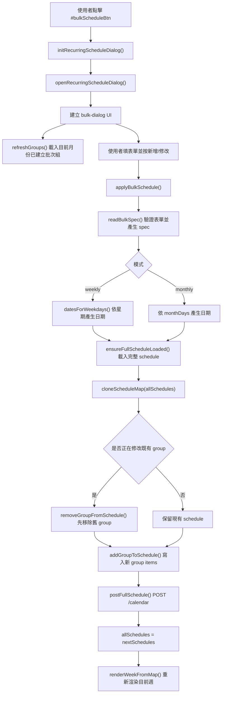
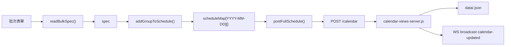
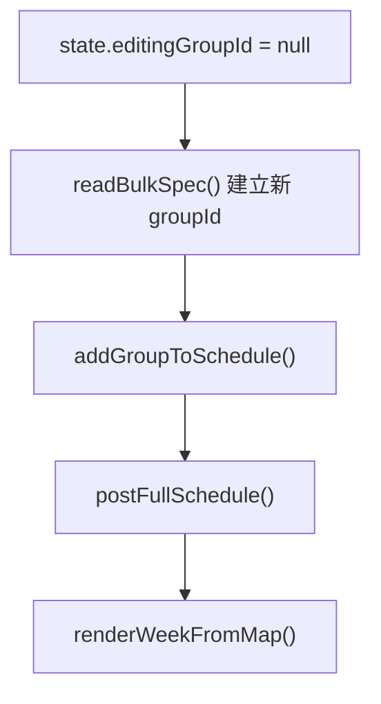
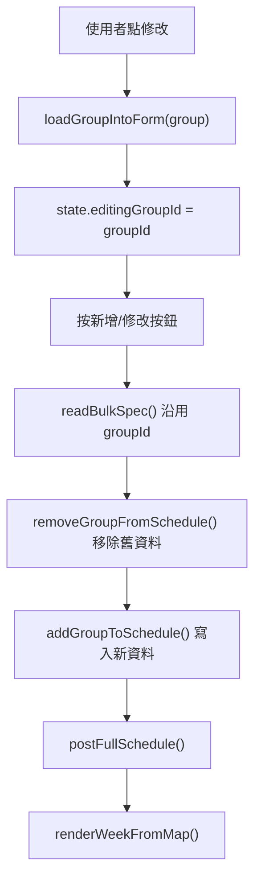
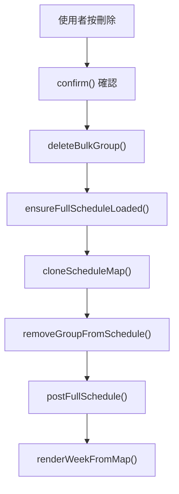

# Manage Recurring Items

本文件整理目前週曆中「批次產生週期事件」功能的程式流向。這個功能由 weekbar 上的管理 icon 進入，讓使用者依年份、月份、時間、內容，以及「每週星期」或「每月日期」批次建立固定行程，並可再回到管理面板中修改或刪除同一組批次任務。

## 功能範圍

### 使用者操作

- 點擊週曆右上角的批次任務按鈕：`#bulkScheduleBtn`
- 選擇年份、月份、開始時間、結束時間、任務文字
- 選擇批次模式：
  - `weekly`：依星期產生，例如 MON-FRI
  - `monthly`：依每月日期產生，例如 1、15、30
- 按新增後，系統會將同一批任務寫成一組 `repeatGroupId`
- 使用者可從任務 block 上的固定 icon 或管理面板列表再進入修改/刪除

### 資料結果

批次產生的每一筆行程仍是一般週曆 block，但會多帶以下 metadata，讓系統知道它屬於哪一組批次任務：

```json
{
  "id": "t...",
  "start_time": "08:00",
  "end_time": "09:00",
  "text": "固定任務",
  "repeatGroupId": "rg-...",
  "repeatScope": "2026-06",
  "repeatPattern": "weekly",
  "repeatYearMonth": "2026-06",
  "repeatDaysLabel": "MON, TUE, WED"
}
```

## 檔案位置

| 檔案 | 角色 | 主要責任 |
| --- | --- | --- |
| `weekly-calendar/weekly-calendar.html` | 入口 HTML | 放置 `#bulkScheduleBtn`，載入 `recurring-schedule.css` 和 `recurring-schedule.js` |
| `weekly-calendar/recurring-schedule.js` | 批次週期事件主程式 | 建立管理視窗、讀取表單、產生日期、寫入完整 schedule、修改/刪除批次組 |
| `weekly-calendar/recurring-schedule.css` | 批次管理 UI 樣式 | 管理按鈕、彈窗、日期/星期選擇、已建立群組列表 |
| `weekly-calendar/weekly-calendar-core.js` | 週曆核心 | 建立 block、渲染 block、序列化每日資料、保留 repeat metadata、顯示固定任務 icon |
| `weekly-calendar/setupElements.js` | 儲存與載入週資料 | `persistDay()`、`persistWeek()`、`loadWeek()`，保存 repeat metadata |
| `weekly-calendar/interact-drag-resize.js` | 拖曳與 resize | 移動 block 時保留 repeat metadata |
| `calendar-views-server.js` | HTTP / WS server | 提供 `/schedule`、`/schedule/:date`、`/calendar`，將資料寫入 `data/<user>.json` 並廣播更新 |
| `data/<userId>.json` | 使用者資料 | 真正存放日期對應的 schedule map |

## 整體流程



## 主要 Function 說明

### 初始化與入口

| Function | 檔案 | 說明 |
| --- | --- | --- |
| `initRecurringScheduleDialog({ setupInteract, getDayCols })` | `weekly-calendar/recurring-schedule.js` | 綁定 `#bulkScheduleBtn` click，開啟批次固定任務面板 |
| `openRecurringScheduleDialog({ setupInteract, getDayCols, focusGroupId })` | `weekly-calendar/recurring-schedule.js` | 建立彈窗 DOM、初始化年月與星期/日期選項、綁定新增/修改/刪除事件 |
| `createBlockElement(...)` | `weekly-calendar/weekly-calendar-core.js` | 建立一般週曆 block；若有 `repeatGroupId`，會顯示固定任務 icon |
| `window.openRecurringScheduleDialog(...)` | `weekly-calendar/weekly-calendar-core.js` 呼叫 | 點擊 block 上固定 icon 時，用 `focusGroupId` 打開對應批次組 |

### 表單與日期選擇

| Function | 檔案 | 說明 |
| --- | --- | --- |
| `renderWeeklyChoices(container)` | `weekly-calendar/recurring-schedule.js` | 建立 MON-SUN checkbox，預設 MON-FRI 勾選 |
| `renderMonthChoices(container, year, month)` | `weekly-calendar/recurring-schedule.js` | 依指定年月產生 1 到月底日期 checkbox |
| `getMode(root)` | `weekly-calendar/recurring-schedule.js` | 讀取目前模式：`weekly` 或 `monthly` |
| `checkedNumbers(container)` | `weekly-calendar/recurring-schedule.js` | 讀取已勾選 checkbox 數字，並排序 |
| `datesForWeekdays(year, month, weekdays)` | `weekly-calendar/recurring-schedule.js` | 將指定月份中符合 weekday 的日期轉成 `YYYY-MM-DD` 清單 |
| `weekdayLabel(day)` | `weekly-calendar/recurring-schedule.js` | 將 `0-6` 轉成 `SUN-SAT` |

### 新增與修改

| Function | 檔案 | 說明 |
| --- | --- | --- |
| `applyBulkSchedule(...)` | `weekly-calendar/recurring-schedule.js` | 新增/修改批次任務的主要流程 |
| `readBulkSpec(overlay, editingGroupId)` | `weekly-calendar/recurring-schedule.js` | 驗證年份、月份、時間、文字與勾選項目，產生 spec |
| `addGroupToSchedule(scheduleMap, spec)` | `weekly-calendar/recurring-schedule.js` | 將 spec 展開成多筆日期 block，並寫入 `repeatGroupId` metadata |
| `removeGroupFromSchedule(scheduleMap, groupId)` | `weekly-calendar/recurring-schedule.js` | 從整份 schedule 中移除同一個 `repeatGroupId` 的所有項目 |
| `cloneScheduleMap(scheduleMap)` | `weekly-calendar/recurring-schedule.js` | 深拷貝目前 schedule，避免直接改到原物件造成中途狀態污染 |

### 群組列表與編輯

| Function | 檔案 | 說明 |
| --- | --- | --- |
| `refreshGroups()` | `weekly-calendar/recurring-schedule.js` | 載入完整 schedule，收集目前年月的批次群組並重畫列表 |
| `collectRecurringGroups(scheduleMap, year, month)` | `weekly-calendar/recurring-schedule.js` | 掃描指定月份資料，依 `repeatGroupId` 彙整出群組資訊 |
| `renderGroupList(container, groups)` | `weekly-calendar/recurring-schedule.js` | 顯示已建立批次任務列表，提供修改與刪除按鈕 |
| `findFirstDateForGroup(scheduleMap, groupId)` | `weekly-calendar/recurring-schedule.js` | 從完整 schedule 找出某批次組第一個日期，用於 focusGroupId 導回正確年月 |
| `loadGroupIntoForm(group)` | `weekly-calendar/recurring-schedule.js` | 將既有 group 填回表單，進入修改模式 |

### 刪除

| Function | 檔案 | 說明 |
| --- | --- | --- |
| `deleteBulkGroup(...)` | `weekly-calendar/recurring-schedule.js` | 刪除整組批次任務 |
| `removeGroupFromSchedule(scheduleMap, groupId)` | `weekly-calendar/recurring-schedule.js` | 實際刪除同一 `repeatGroupId` 的所有項目 |
| `postFullSchedule(scheduleMap)` | `weekly-calendar/recurring-schedule.js` | 將刪除後的完整 schedule 寫回 server |

### 儲存與重新渲染

| Function | 檔案 | 說明 |
| --- | --- | --- |
| `ensureFullScheduleLoaded(messageEl)` | `weekly-calendar/recurring-schedule.js` | `GET /schedule` 取得完整使用者 schedule |
| `postFullSchedule(scheduleMap)` | `weekly-calendar/recurring-schedule.js` | `POST /calendar` 寫回完整 schedule map |
| `renderWeekFromMap(startDate, setupInteract, allSchedules, getDayCols)` | `weekly-calendar/setupElements.js` | 用最新 `allSchedules` 重畫目前週 |
| `serializeDay(dayIndex)` | `weekly-calendar/weekly-calendar-core.js` | 將 DOM block 轉回 JSON，包含 repeat metadata |
| `buildPayloadForDate(dateStr)` | `weekly-calendar/setupElements.js` | 從 `allSchedules[dateStr]` 建立單日保存 payload，包含 repeat metadata |

## 資料流



## 新增 / 修改的差異

### 新增



### 修改



### 刪除



## 與週曆核心的接點

### block 建立與顯示

`weekly-calendar/weekly-calendar-core.js` 的 `createBlockElement()` 會接收：

- `repeatGroupId`
- `repeatScope`
- `repeatPattern`
- `repeatYearMonth`
- `repeatDaysLabel`

如果 `repeatGroupId` 存在，block 上的 `.repeat-badge` 會顯示。使用者點它時會呼叫：

```js
window.openRecurringScheduleDialog({
  setupInteract,
  getDayCols,
  focusGroupId: block.dataset.repeatGroupId
});
```

這讓使用者可以從任一批次 block 回到整組任務的管理狀態。

### 儲存 metadata

為了避免一般儲存、拖曳或 resize 後失去批次資訊，以下位置都會保留 repeat 欄位：

| 檔案 | 保留位置 |
| --- | --- |
| `weekly-calendar/weekly-calendar-core.js` | `serializeDay()`、`renderDayFromData()`、`createBlockElement()` |
| `weekly-calendar/setupElements.js` | `buildPayloadForDate()` |
| `weekly-calendar/interact-drag-resize.js` | block 移動日期時建立 `movedItem` |

## Server API

| API | Method | 使用位置 | 說明 |
| --- | --- | --- | --- |
| `/schedule` | GET | `ensureFullScheduleLoaded()` | 取得目前 user 的完整 schedule map |
| `/calendar` | POST | `postFullSchedule()` | 寫回完整 schedule map，用於批次新增/修改/刪除 |
| `/schedule/:date` | POST | `persistDay()` | 單日保存，一般編輯或拖曳後使用 |
| `/schedule?from=...&to=...` | GET | `loadWeek()` | 載入目前週資料 |

## 重要設計點

### 為什麼批次功能使用完整 schedule 寫回

批次任務可能跨多天，而且修改/刪除時需要找到同一 `repeatGroupId` 的所有項目。如果只保存單日，很容易出現「改了一天但其他天還留著舊資料」的狀況。因此流程是：

1. `GET /schedule` 載入完整資料
2. clone 出 `nextSchedules`
3. 修改 `nextSchedules`
4. `POST /calendar` 寫回完整資料
5. 更新前端 `allSchedules`
6. 重畫目前週

### 為什麼需要 repeatGroupId

`repeatGroupId` 是整組批次任務的識別碼。每一天的 block 都有自己的 `id`，但同一批任務共享同一個 `repeatGroupId`，因此可以一次修改或刪除。

### 為什麼需要 repeatPattern / repeatDaysLabel

- `repeatPattern` 用來知道它是 `weekly` 還是 `monthly`
- `repeatDaysLabel` 用來顯示使用者當初套用的星期或日期摘要
- `repeatYearMonth` / `repeatScope` 用來標示這組任務屬於哪個年月

## 開發時檢查清單

1. `node --check weekly-calendar/recurring-schedule.js`
2. `node --check weekly-calendar/weekly-calendar-core.js`
3. `node --check weekly-calendar/setupElements.js`
4. `node --check weekly-calendar/interact-drag-resize.js`
5. 開啟 `http://localhost:3011/week/`
6. 點擊右上角批次按鈕
7. 測試每週模式：MON-FRI 是否正確生成
8. 測試每月模式：指定日期是否正確生成
9. 點 block 上固定 icon，確認可回到該 group 修改
10. 修改時間/文字/日期後，確認舊 group 不殘留
11. 刪除 group，確認所有同 group block 都消失
12. 重新整理頁面，確認資料仍存在且 fixed icon 正常顯示
