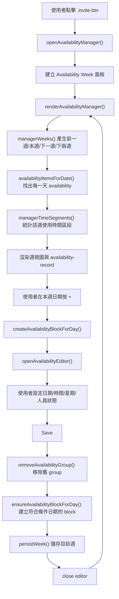
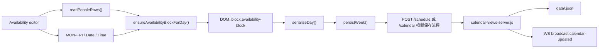
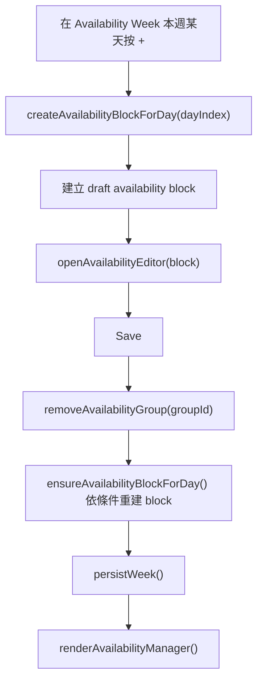
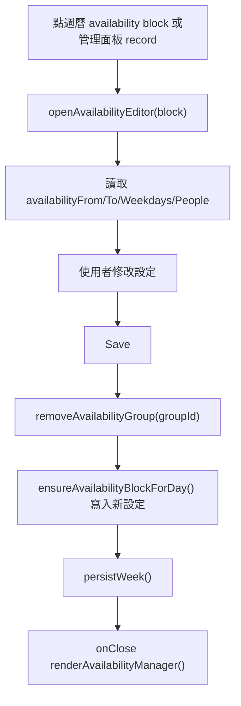
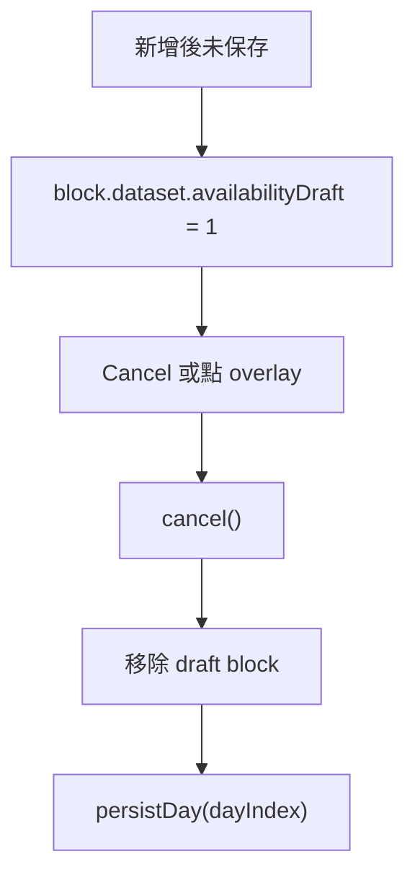

# View Availability

本文件整理週曆中「View Availability」功能的程式流向。這個功能由 weekbar 上的 availability icon 進入，用來記錄人員在指定日期區間、指定時間內的 `free` / `not-free` 狀態，並在週曆 block 與管理面板中以顏色 chip 顯示。

## 功能範圍

### 使用者操作

- 點擊週曆右上角 availability 按鈕：`.invite-btn`
- 開啟 Availability Week 管理面板
- 在目前週的某一天按 `+` 建立 availability block
- 在編輯視窗設定：
  - MON-FRI 套用星期
  - Date from / to
  - Time start / end，限制在 `07:00` 到 `19:00`
  - 多位人員與狀態：`free` 或 `not-free`
- 儲存後，週曆上對應日期會出現 availability block
- 點週曆 block 或管理面板 record 可再次開啟 editor 修改

### 顯示方式

- `free` 使用綠色 chip：`#0a7`
- `not-free` 使用深紅 chip：`#8b0000`
- 週曆 block 不顯示 `free` / `not free` 文字，只用 chip 背景顏色表示狀態
- Availability Week 管理面板顯示前一週、本週、下一週、下兩週
- 管理面板會依每週實際使用到的時間區段壓縮 Y 軸
- 若該週沒有 availability 資料，只顯示 `09:00-10:00`

### 資料結果

Availability block 是週曆 block 的一種特殊類型，會多帶以下 metadata：

```json
{
  "id": "t...",
  "type": "availability",
  "start_time": "08:30",
  "end_time": "09:30",
  "text": "",
  "availabilityFrom": "2026-06-25",
  "availabilityTo": "2026-06-26",
  "availabilityWeekdays": [3, 4],
  "availabilityGroupId": "av_...",
  "availabilityPeople": [
    { "name": "charles", "status": "not-free" },
    { "name": "eric", "status": "free" }
  ]
}
```

## 檔案位置

| 檔案 | 角色 | 主要責任 |
| --- | --- | --- |
| `weekly-calendar/weekly-calendar.html` | 入口 HTML | 放置 `.invite-btn`，載入 `availability-schedule.css` 和 `availability-schedule.js` |
| `weekly-calendar/availability-schedule.js` | Availability 主程式 | 建立管理面板、建立/編輯 availability block、渲染 chip、過濾日期區間與星期 |
| `weekly-calendar/availability-schedule.css` | Availability UI 樣式 | availability block、chip、editor、管理面板、壓縮時間軸與 scrollbar |
| `weekly-calendar/weekly-calendar-core.js` | 週曆核心 | 建立 block、渲染 block、序列化每日資料、保留 availability metadata |
| `weekly-calendar/setupElements.js` | 儲存與載入週資料 | `persistDay()`、`persistWeek()`、`loadWeek()`，保存 availability metadata |
| `weekly-calendar/interact-drag-resize.js` | 拖曳與 resize | 移動 availability block 時保留 metadata |
| `calendar-views-server.js` | HTTP / WS server | 提供 `/schedule`、`/schedule/:date`、`/calendar`，將資料寫入 `data/<user>.json` 並廣播更新 |
| `data/<userId>.json` | 使用者資料 | 真正存放日期對應的 schedule map |

## 整體流程



## 主要 Function 說明

### 初始化與入口

| Function | 檔案 | 說明 |
| --- | --- | --- |
| `openAvailabilityManager()` | `weekly-calendar/availability-schedule.js` | 建立 Availability Week 管理面板 |
| `renderAvailabilityManager()` | `weekly-calendar/availability-schedule.js` | 根據 `allSchedules` 渲染四週 availability 管理視圖 |
| DOMContentLoaded listener | `weekly-calendar/availability-schedule.js` | 綁定 `.invite-btn` click，開啟 availability 管理面板 |
| `createBlockElement(...)` | `weekly-calendar/weekly-calendar-core.js` | 建立一般週曆 block；當 `itemType` 是 `availability` 時加入 `.availability-block` |

### 日期與時間

| Function | 檔案 | 說明 |
| --- | --- | --- |
| `currentWeekDates()` | `weekly-calendar/availability-schedule.js` | 產生目前週 MON-SUN 日期資訊 |
| `weekDatesForOffset(weekOffset)` | `weekly-calendar/availability-schedule.js` | 依週偏移產生某一週 MON-SUN |
| `managerWeeks()` | `weekly-calendar/availability-schedule.js` | 建立管理面板四週：前一週、本週、下一週、下兩週 |
| `dateInRange(dateStr, fromDate, toDate)` | `weekly-calendar/availability-schedule.js` | 判斷日期是否落在 Date from/to 區間 |
| `weekdayIndexFromDateStr(dateStr)` | `weekly-calendar/availability-schedule.js` | 將日期轉為 MON=0 到 SUN=6 的索引 |
| `parseWeekdaysFromData(value, fallback)` | `weekly-calendar/availability-schedule.js` | 從 JSON 或 array 取得 MON-FRI 套用條件 |
| `clampAvailabilityTime(value, fallback)` | `weekly-calendar/availability-schedule.js` | 將時間限制在 `07:00-19:00`，並對齊 30 分鐘 |
| `createTimeOptions(selectedValue)` | `weekly-calendar/availability-schedule.js` | 建立 `07:00-19:00` 的 24 小時下拉選單 |
| `blockTimes(block)` | `weekly-calendar/availability-schedule.js` | 從 block 的 top/height 換算 start/end time |
| `applyTimesToBlock(block, startHHmm, endHHmm)` | `weekly-calendar/availability-schedule.js` | 將指定時間寫回 block top/height |

### 人員與狀態

| Function | 檔案 | 說明 |
| --- | --- | --- |
| `normalizePeople(people)` | `weekly-calendar/availability-schedule.js` | 清理人員資料，只保留有 name 的資料，狀態限制為 `free` / `not-free` |
| `parsePeopleFromData(value)` | `weekly-calendar/availability-schedule.js` | 從 array 或 JSON 字串讀取人員資料 |
| `parsePeople(block)` | `weekly-calendar/availability-schedule.js` | 從 block dataset 讀取 `availabilityPeople` |
| `createPersonRow(person)` | `weekly-calendar/availability-schedule.js` | 建立 editor 中的一列人員輸入 |
| `readPeopleRows(peopleEl)` | `weekly-calendar/availability-schedule.js` | 從 editor DOM 讀回人員與狀態 |
| `renderAvailabilityBlock(block)` | `weekly-calendar/availability-schedule.js` | 將 availability block 內容渲染成 chip list |

### 建立與編輯

| Function | 檔案 | 說明 |
| --- | --- | --- |
| `createAvailabilityBlockForDay(dayIndex)` | `weekly-calendar/availability-schedule.js` | 在本週某天建立 draft availability block |
| `openAvailabilityEditor(block, { onClose })` | `weekly-calendar/availability-schedule.js` | 開啟 availability 編輯視窗 |
| `ensureAvailabilityBlockForDay(...)` | `weekly-calendar/availability-schedule.js` | 根據日期、時間、星期、人員資料建立正式 block |
| `removeAvailabilityGroup(groupId)` | `weekly-calendar/availability-schedule.js` | 移除同一 `availabilityGroupId` 的 DOM block |
| `attachAvailabilityBlockEditor(block)` | `weekly-calendar/availability-schedule.js` | 讓 availability block 點擊後可開啟 editor |

### 管理面板渲染

| Function | 檔案 | 說明 |
| --- | --- | --- |
| `availabilityItemsForDate(dateStr)` | `weekly-calendar/availability-schedule.js` | 從完整 `allSchedules` 找出對指定日期有效的 availability items |
| `annotateOverlap(items)` | `weekly-calendar/availability-schedule.js` | 計算同日重疊時段的 overlap level |
| `managerTimeSegments(week)` | `weekly-calendar/availability-schedule.js` | 統計該週實際使用的時間區段，壓縮 Y 軸 |
| `managerRecordMetrics(item, segments)` | `weekly-calendar/availability-schedule.js` | 將 availability item 放到壓縮時間軸中的 top/height |
| `renderAvailabilityManager()` | `weekly-calendar/availability-schedule.js` | 渲染四週管理面板、時間軸、日期欄、record chip |

### 儲存與保留 metadata

| Function | 檔案 | 說明 |
| --- | --- | --- |
| `serializeDay(dayIndex)` | `weekly-calendar/weekly-calendar-core.js` | 將 DOM block 轉 JSON，包含 availability metadata |
| `renderDayFromData(dayIndex, items, setupInteract)` | `weekly-calendar/weekly-calendar-core.js` | 從後端資料重建 block，包含 availability metadata |
| `buildPayloadForDate(dateStr)` | `weekly-calendar/setupElements.js` | 從 `allSchedules[dateStr]` 建立單日保存 payload，包含 availability metadata |
| `persistWeek()` | `weekly-calendar/setupElements.js` | 保存目前週，editor 儲存 availability 後使用 |
| moved item 建立流程 | `weekly-calendar/interact-drag-resize.js` | block 拖曳到其他日期時保留 availability metadata |

## 資料流



## 建立 / 修改 / 取消流程

### 建立



### 修改



### 取消 draft



## 與週曆核心的接點

### block 建立與顯示

`weekly-calendar/weekly-calendar-core.js` 的 `createBlockElement()` 會接收：

- `itemType`
- `availabilityFrom`
- `availabilityTo`
- `availabilityWeekdays`
- `availabilityGroupId`
- `availabilityPeople`

當 `itemType === 'availability'` 時：

- block 會加上 `.availability-block`
- block 的一般文字內容會改由 `renderAvailabilityBlock(block)` 顯示
- 一般新增文字、delete icon、某些文字編輯行為會避開 availability block

### 保存 metadata

為了避免儲存、重載、拖曳後 availability 設定掉失，以下位置都會保存欄位：

| 檔案 | 保存位置 |
| --- | --- |
| `weekly-calendar/weekly-calendar-core.js` | `serializeDay()`、`renderDayFromData()`、`createBlockElement()` |
| `weekly-calendar/setupElements.js` | `buildPayloadForDate()` |
| `weekly-calendar/interact-drag-resize.js` | block 移動日期時建立 `movedItem` |

## Server API

| API | Method | 使用位置 | 說明 |
| --- | --- | --- | --- |
| `/schedule?from=...&to=...` | GET | `loadWeek()` | 載入目前週資料 |
| `/schedule/:date` | POST | `persistDay()` | 單日保存，取消 draft 或一般互動後使用 |
| `/schedule` | POST | `persistWeek()` 或範圍保存流程 | 保存一段日期資料 |
| `/calendar` | POST | 完整 schedule 保存流程 | 寫回完整使用者資料 |

## 重要設計點

### 為什麼 availability 有 groupId

一筆 availability 設定可能套用到多天，例如 Date from/to 是 2026-06-25 到 2026-06-26，並勾選 THU/FRI。每一天會建立自己的 block，但同一批設定共享 `availabilityGroupId`。修改時先用 `removeAvailabilityGroup(groupId)` 移除舊 DOM，再依新設定重建。

### 為什麼要保存 availabilityWeekdays

`availabilityFrom` / `availabilityTo` 只能表示日期範圍，不能表示「只套用 MON-FRI 中哪些天」。因此需要 `availabilityWeekdays`，讓 `availabilityItemsForDate(dateStr)` 能過濾未勾選的星期。

### 為什麼管理面板要壓縮時間軸

Availability 通常只關心幾段時間，例如 `08:30-09:30`、`16:30-17:30`。`managerTimeSegments(week)` 會統計該週實際使用的時間區段，只顯示需要的整點範圍，減少空白。

### 為什麼 free / not-free 不顯示文字

週曆 block 空間有限，所以只顯示人名 chip，狀態用背景顏色表示：

- `free`：綠色
- `not-free`：深紅色

這樣能讓 block 在小尺寸下仍保持可讀。

## 開發時檢查清單

1. `node --check weekly-calendar/availability-schedule.js`
2. `node --check weekly-calendar/weekly-calendar-core.js`
3. `node --check weekly-calendar/setupElements.js`
4. `node --check weekly-calendar/interact-drag-resize.js`
5. 開啟 `http://localhost:3011/week/`
6. 點擊右上角 availability icon
7. 在本週某天按 `+` 建立 availability
8. 測試 `07:00-19:00` 時間選單
9. 測試 MON-FRI 勾選是否只套用到指定星期
10. 新增多位人員，確認 `free` / `not-free` chip 顏色正確
11. 點週曆 block 或管理面板 record，確認可回 editor 修改
12. 重新整理頁面，確認 availabilityPeople、availabilityWeekdays、availabilityFrom/To 都仍存在

